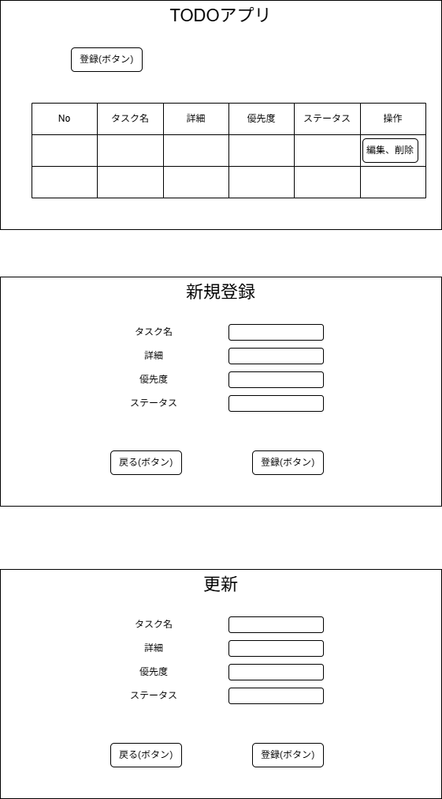
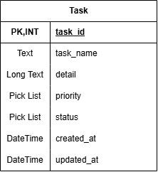

# ToDoアプリ

## 概要
タスク管理をするアプリケーションです

## 使用技術
- Java
- Spring Boot
- PostgreSQL
- Thymeleaf
- Maven
- GitHub

## 機能一覧
- タスク一覧表示
- タスク登録
- タスク編集
- タスク削除
- ステータス管理
- バリデーションチェック
- ソート機能

## 画面一覧

## ER図

## テーブル設計

## 起動方法

